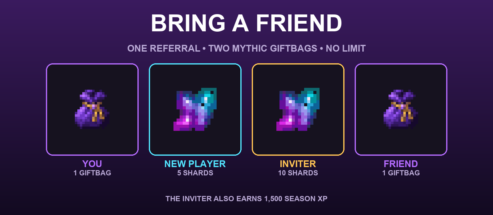

## How it works

The person joining types **`/referredby <your Minecraft name>`** after they enter the server.

They must do it during their first **60 ONLINE MINUTES**. Logging out pauses that window — it does not keep counting while they are away.

The inviter does **not** enter a code. The new or returning player names the person who actually brought them.

Once the referral is accepted, the rewards are paid immediately. If somebody is offline, their rewards wait safely and arrive the next time they join.

## Bringing A New Player

A new player is somebody genuinely joining Mysterious SMP X for the first time — not another Java or Bedrock account belonging to somebody already here.

### The new player gets

:item[shard] **5 SHARDS**
:item[mythic_giftbag] **1 MYTHIC GIFTBAG**

### The inviter gets

:item[shard] **10 SHARDS**
:item[experience_bottle] **1,500 SEASON XP**
:item[mythic_giftbag] **1 MYTHIC GIFTBAG**

That is **TWO GIFTBAGS** from one real new-player referral.

## Bringing A Player Back

A returning player must have been away for at least **10 DAYS** and must already have at least **60 MINUTES** of lifetime playtime.

### The returning player gets

:item[shard] **5 SHARDS** for coming back, whether or not somebody referred them.

### If they name who brought them back, the inviter gets

:item[shard] **5 SHARDS**
:item[experience_bottle] **1,500 SEASON XP**
:item[mythic_giftbag] **1 MYTHIC GIFTBAG**

The same person can earn the returning-player reward again after another qualifying absence, but no more than once every **30 DAYS** across all of their linked accounts.

## Who Can Be The Inviter?

The inviter must be an established player:

- Their account must have been on the server for at least **7 DAYS**.
- They must have at least **60 MINUTES** of lifetime playtime.
- They cannot be the same person on another linked account.
- Accounts that have used the same connection cannot refer each other.
- Two players cannot take turns referring each other for repeat rewards.

There is **NO LIMIT** on how many different, genuine players one person can bring.

## The Four Steps

### 1. Invite them

Send your friend the Discord invite and help them verify the Minecraft account they will actually use.

### 2. They join

They enter the real server as a brand-new player, or return after a qualifying absence.

### 3. They name you

They type **`/referredby <your Minecraft name>`** within their first **60 online minutes**.

Use the inviter's exact Minecraft name. An accepted referral cannot be moved to somebody else afterwards.

### 4. Everybody gets paid

Online rewards arrive immediately. Offline Shards, Season XP and Giftbags are saved until their owner returns.

## Check Your Referrals

Type **`/referrals`** in game to see the current rewards, whether you can still name an inviter, and how many players you have brought.

The in-game screen always shows the server's current reward values if they are ever adjusted.

*Bring a real friend. Keep the rewards. Build something worth bringing the next one back to.*
